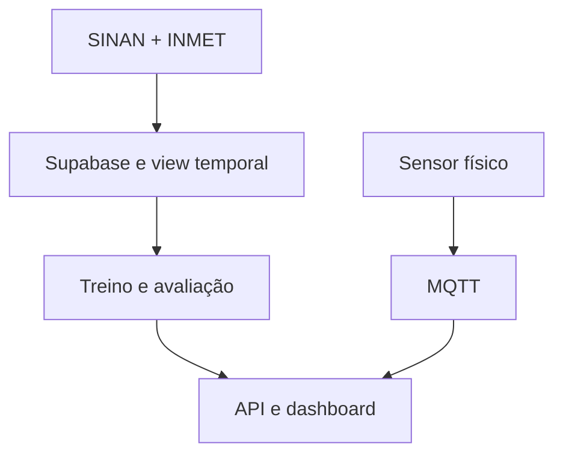

# Arquitetura híbrida

O sistema mantém três módulos explicitamente separados. Isso evita alegar que o sensor mede diretamente leptospirose ou que dados simulados representam evidência epidemiológica.

## 1. Camada histórica de modelagem

SINAN e INMET são tratados e relacionados no Supabase. A view privada `tcc_private.dataset_modelagem` materializa, por semana e horizonte, apenas variáveis que estariam disponíveis na data de corte. O treinamento ocorre fora do banco e produz métricas, previsões e artefatos versionados.

## 2. Camada física IoT

O dispositivo mede parâmetros físico-químicos, envia mensagens via internet/MQTT e comprova a integração obrigatória com hardware. Essa camada é validada por conectividade, integridade da mensagem, latência e estabilidade. Até haver dados reais suficientes, as leituras servem ao monitoramento operacional e não entram no treino histórico.

## 3. Aplicação integrada

O backend e o dashboard apresentam lado a lado:

- risco epidemiológico previsto pelo modelo histórico;
- condições ambientais e meteorológicas;
- telemetria atual do protótipo IoT;
- data de atualização, origem e limitações de cada indicador.

## Bancos e fluxos

O Supabase é a única fonte oficial persistente. O `docker-compose.yml` local sobe somente o broker Mosquitto, evitando um segundo PostgreSQL divergente.

## Barreiras contra leakage

- chave única: `(horizonte, inicio_semana_t)`;
- `data_corte` é o domingo da semana `t`;
- alvo sempre ocorre após a data de corte;
- `t+1` inicia 7 dias e `t+2` 14 dias após `inicio_semana_t`;
- transformação e imputação são ajustadas somente no treino;
- seleção de modelo usa 2023; 2024 permanece teste final bloqueado;
- métricas são comparadas com baselines ingênuos e sazonais.

## Próxima evolução

Somente após acumular telemetria real com cobertura e duração adequadas será testado um modelo exploratório que incorpore sensores. Esse experimento deve ser relatado como extensão, não como substituto da validação histórica.
